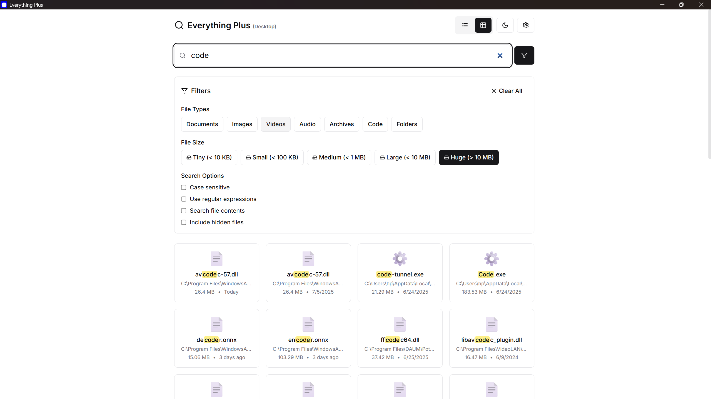
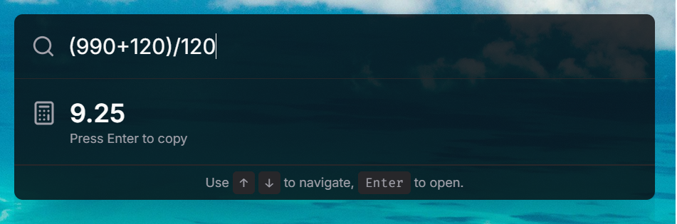
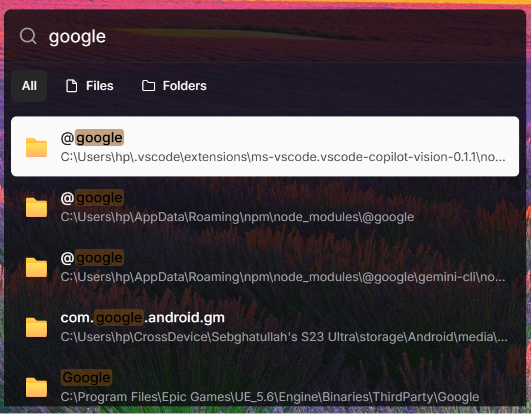

# Everything Plus - Modern File Search Application


## Screenshots

| Main Search UI | Spotlight Calculator | Spotlight Search |
|:--------------:|:----------:|:----------------:|
|  |  |  |

> _All screenshots are from local development builds. Images are located in `assets/screenshots/`._

## Features
- **Real-time file/folder indexing** - Instant indexing of NTFS file systems and network drives
- **Lightning-fast search** - Sub-100ms search responses as you type with Everything SDK integration
- **Advanced filtering** - Size, date, type filters with regular expression and case-sensitive search support
- **Modern responsive UI** - Clean, minimal design with dark/light theme support and customizable views
- **System integration** - Windows context menu integration, global keyboard shortcuts, and system tray presence
- **Cross-platform support** - Native Windows desktop app with fallback search for development
- **Performance optimized** - Maximum 50MB memory usage idle, WebAssembly modules for search operations

## About
Everything Plus is a modern file search application that brings the power of Everything's lightning-fast file indexing to a beautiful, modern interface. Built as a native Windows desktop application using Tauri, it combines the speed of Rust backend with Everything SDK integration and a responsive React TypeScript frontend. The application provides instant file search capabilities across your entire system with advanced filtering options and seamless system integration.

**Current Status**: Development version with real Everything SDK integration and fallback search capabilities.

## Installation

### Prerequisites

Before you begin, ensure you have the following installed on your Windows system:

1. **Node.js 18+** 
   - Download from: https://nodejs.org/
   - Verify installation: `node --version` and `npm --version`

2. **Rust (latest stable)**
   - Install via rustup: https://rustup.rs/
   - Run: `curl --proto '=https' --tlsv1.2 -sSf https://sh.rustup.rs | sh`
   - Verify installation: `rustc --version` and `cargo --version`

3. **Everything Application**
   - Download and install from: https://www.voidtools.com/downloads/
   - **Important**: Make sure Everything is running in the background
   - The application requires Everything's SDK which comes with the installation

4. **Git**
   - Download from: https://git-scm.com/downloads
   - Verify installation: `git --version`

### Quick Start

```bash
# 1. Clone the repository
git clone https://github.com/SebghatYusuf/everything-plus.git
cd everything-plus

# 2. Install Node.js dependencies
npm install

# 3. Install Rust dependencies and build
cargo build

# 4. Install Tauri CLI (if not already installed)
npm install -g @tauri-apps/cli

# 5. Start Everything application (if not already running)
# Open Everything from Start Menu or run: "C:\Program Files\Everything\Everything.exe"

# 6. Build and run the application in development mode
npm run tauri dev
```

### Production Build

```bash
# Build for production (creates installer in src-tauri/target/release/bundle/)
npm run tauri build
```

### Troubleshooting

**If Everything DLL fails to load:**
1. Ensure Everything is installed and running
2. Check that Everything.exe is running in Task Manager
3. The app will automatically fall back to basic file system search if Everything SDK is unavailable

**If Rust compilation fails:**
1. Update Rust: `rustup update`
2. Install Windows build tools: `npm install -g windows-build-tools`
3. Install Visual Studio Build Tools with C++ workload

**If npm install fails:**
1. Clear npm cache: `npm cache clean --force`
2. Delete node_modules and package-lock.json, then run `npm install` again
3. Try using yarn instead: `npm install -g yarn && yarn install`

### Development Setup

For contributors and developers:

```bash
# Install development dependencies
npm install --include=dev

# Install Rust development tools
rustup component add clippy rustfmt

# Run frontend only (for UI development)
cd frontend && npm run dev

# Run backend tests
cargo test

# Format Rust code
cargo fmt

# Lint Rust code
cargo clippy

# Build with verbose output for debugging
cargo build --verbose
```

## Usage
1. **Launch the application** - Use global shortcut `Ctrl+Space` or click the system tray icon
2. **Start typing** - Search results appear instantly as you type
3. **Use filters** - Apply size, date, and file type filters for refined results
4. **Open files** - Double-click to open files or right-click for context menu options
5. **Navigate efficiently** - Use keyboard shortcuts for quick navigation and file operations

## Technical Details
- **Framework**: Tauri (Rust + React TypeScript)
- **Backend**: Rust with Everything SDK FFI integration
- **Frontend**: React 18+ with TypeScript, Tailwind CSS v4.x, Shadcn/UI components
- **Database**: Everything's native indexing (no custom database required)
- **Build System**: Cargo (Rust) + npm/Vite (Frontend)
- **Dependencies**: 
  - **Rust**: everything-plus-backend, tauri, winapi, anyhow, chrono, serde, tokio, tracing
  - **Node.js**: @tauri-apps/api, react, typescript, tailwindcss, @radix-ui/react-*
- **System Requirements**: 
  - **OS**: Windows 10/11 (x64)
  - **Runtime**: Everything application installed and running
  - **Memory**: 4GB RAM minimum, 8GB recommended
  - **Storage**: 100MB disk space for application, additional space for Everything's index
  - **Development**: Node.js 18+, Rust 1.70+, Git

## Project Structure

```
everything-plus/
├── src-tauri/              # Tauri Rust backend
│   ├── src/
│   │   ├── main.rs         # Tauri application entry point
│   │   └── lib.rs          # Tauri command handlers
│   ├── Cargo.toml          # Rust dependencies
│   └── tauri.conf.json     # Tauri configuration
├── backend/                # Core Rust backend logic
│   ├── src/
│   │   ├── lib.rs          # Backend library entry point
│   │   ├── everything_sdk.rs # Everything SDK integration
│   │   ├── types.rs        # Shared data types
│   │   └── main.rs         # Standalone backend runner
│   └── Cargo.toml          # Backend dependencies
├── frontend/               # React TypeScript frontend
│   ├── src/
│   │   ├── components/     # React components
│   │   ├── hooks/          # Custom React hooks
│   │   ├── lib/            # Utility functions
│   │   └── App.tsx         # Main application component
│   ├── package.json        # Frontend dependencies
│   └── tailwind.config.js  # Tailwind CSS configuration
├── package.json            # Root package.json with scripts
├── Cargo.toml              # Workspace configuration
└── README.md               # This file
```

## Available Scripts

Once you have the project set up, you can use these npm scripts:

```bash
# Development
npm run tauri dev          # Start the application in development mode
npm run dev                # Start frontend development server only
npm run build              # Build the frontend for production

# Production
npm run tauri build        # Build the complete application with installer
npm run tauri build --debug # Build with debug symbols

# Testing and Quality
npm run test               # Run frontend tests
npm run lint               # Lint frontend code
npm run format             # Format frontend code

# Backend (Rust)
cargo run                  # Run the standalone backend
cargo test                 # Run Rust tests
cargo build --release      # Build optimized backend
cargo clippy               # Lint Rust code
cargo fmt                  # Format Rust code

# Tauri specific
npm run tauri info          # Display Tauri environment info
npm run tauri icon          # Generate app icons from source
```

## Environment Variables

Create a `.env` file in the root directory for configuration:

```env
# Development settings
TAURI_DEBUG=true
RUST_LOG=debug

# Application settings
APP_NAME="Everything Plus"
APP_VERSION="0.1.0"

# Everything SDK settings (optional)
EVERYTHING_SDK_PATH="C:\\Program Files\\Everything\\Everything-SDK"
```

## Contributing
We welcome contributions to improve this project! Here's how you can help:

1. Fork the repository
2. Create your feature branch (`git checkout -b feature/AmazingFeature`)
3. Commit your changes (`git commit -m 'Add some AmazingFeature'`)
4. Push to the branch (`git push origin feature/AmazingFeature`)
5. Open a Pull Request

Please read our [Contributing Guidelines](CONTRIBUTING.md) for details on our code of conduct and submission process.

## Support the Project
If you find this project helpful, please consider:
- ⭐ Starring the repository
- 🐛 Reporting bugs and issues
- 💡 Suggesting new features and improvements
- 🔀 Contributing code or documentation
- 💬 Sharing feedback and use cases

## License
MIT License - see [LICENSE](LICENSE) for details.

## Contact
- **Issues**: [GitHub Issues](https://github.com/SebghatYusuf/everything-plus/issues)
- **Discussions**: [GitHub Discussions](https://github.com/SebghatYusuf/everything-plus/discussions)
- **Everything SDK**: [Official Documentation](https://www.voidtools.com/support/everything/sdk/)
